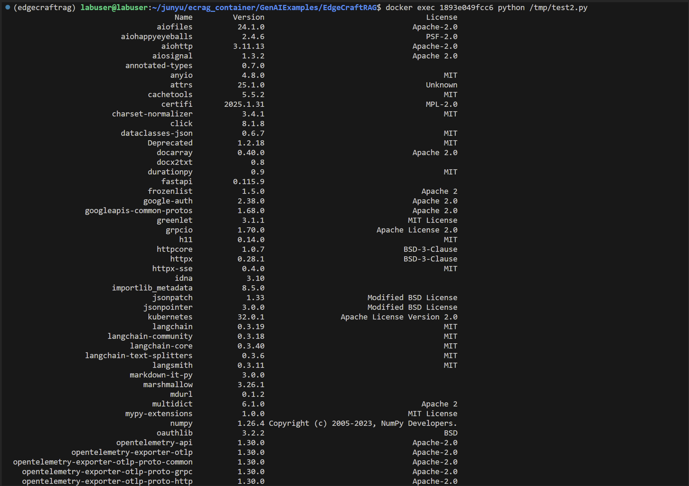

# 关于OneBOM的收集（附脚本）

## 1. OneBOM的收集，不同reviewer可能会要求用不同模板，但是不论模板怎么变化，主要需要收集的内容差别不大，出现过的模板有下面几种：

1. 需要收集：Name, Version, License
2. 需要收集：Name, Version, License, Origin (Channel)
3. 需要收集：Name, Version, License, Origin (Channel), License Link

## 2. 通过下面的脚本可以收集到大部分（三分之二左右）的信息，因为本地pip和conda的meta data局限性，剩余的信息还是需要手动查询一下：

1. 查看脚本帮助：`Python test.py -h`
2. 收集Name列：`python ./test.py Name`会直接在终端按照字母顺序输出package name，可以直接复制后从表格的第一行粘贴，就可以按顺序整洁地显示在excel表里
3. 收集License列：`python ./test.py License`会在终端按照和package name同样顺序输出对应的license，同样，复制后从表格第一行粘贴就可以和name对应上，但是License列会出现一些空格、UNKNOWN情况，如果出现，需要手动再搜索一，比如：

<figure><figcaption></figcaption></figure>

<figure><figcaption></figcaption></figure>

```python
import os
import json
import subprocess
import pandas as pd
import sys

# 获取 Conda 安装路径
CONDA_PREFIX = os.environ.get("CONDA_PREFIX", "")

# 帮助信息
HELP_TEXT = """使用方法：
  python test.py         # 显示完整的 conda list 解析表
  python test.py 列名    # 显示指定列的内容（无索引）
  python test.py -h      # 显示帮助信息

可选列名：
  Name, Version, Build, Channel, License
"""

# 如果用户输入 -h，则显示帮助信息并退出
if len(sys.argv) > 1 and sys.argv[1] == "-h":
    print(HELP_TEXT)
    sys.exit(0)

# 确保 Conda 存在
if not CONDA_PREFIX:
    print("错误：找不到 Conda 环境，请确保 Conda 已正确安装！")
    sys.exit(1)

# 获取通过 conda 安装的包信息
cmd = "conda list --json"
output = subprocess.run(cmd, shell=True, capture_output=True, text=True)

try:
    conda_packages = json.loads(output.stdout)
except json.JSONDecodeError:
    print("错误：无法解析 `conda list` 的 JSON 输出！")
    sys.exit(1)

# 获取 pip 安装的包信息
pip_cmd = "pip list --format json"
pip_output = subprocess.run(pip_cmd, shell=True, capture_output=True, text=True)

try:
    pip_packages = json.loads(pip_output.stdout)
except json.JSONDecodeError:
    print("错误：无法解析 `pip list` 的 JSON 输出！")
    sys.exit(1)

# 提取包信息（conda 和 pip 包都包括）
def get_license(name, is_conda):
    if is_conda:
        # 查找 Conda 包的 License
        meta_dir = os.path.join(CONDA_PREFIX, "conda-meta")
        for file in os.listdir(meta_dir):
            if file.endswith(f"{name}-*.json"):
                try:
                    with open(os.path.join(meta_dir, file), "r", encoding="utf-8") as f:
                        info = json.load(f)
                        return info.get("license", "Unknown")
                except (json.JSONDecodeError, IOError):
                    continue
    else:
        # 查找 pip 包的 License
        cmd = f"pip show {name}"
        result = subprocess.run(cmd, shell=True, capture_output=True, text=True)
        for line in result.stdout.split("\n"):
            if line.lower().startswith("license:"):
                return line.split(":")[-1].strip()
    return "Unknown"

# 获取 Conda 包的基本信息
data = []
for pkg in conda_packages:
    name = pkg.get("name", "Unknown")
    version = pkg.get("version", "Unknown")
    build = pkg.get("build_string", "Unknown")
    channel = pkg.get("channel", "Unknown")
    license = get_license(name, is_conda=True)
    data.append([name, version, build, channel, license])

# 获取 pip 包的基本信息
for pkg in pip_packages:
    name = pkg.get("name", "Unknown")
    version = pkg.get("version", "Unknown")
    build = "N/A"  # pip 包没有 build 字段
    channel = "pip"
    license = get_license(name, is_conda=False)
    data.append([name, version, build, channel, license])

# 创建 DataFrame
columns = ["Name", "Version", "Build", "Channel", "License"]
df = pd.DataFrame(data, columns=columns)

# 让 Pandas 显示所有内容，不折叠
pd.set_option("display.max_colwidth", None)
pd.set_option("display.max_rows", None)
	pd.set_option("display.width", 0)
	
	# 获取用户传入的参数（指定列名）
	if len(sys.argv) > 1:
	    column_name = sys.argv[1]
	    if column_name in df.columns:
	        sys.stdout.write("\n".join(df[column_name].astype(str).tolist()) + "\n")
	    else:
	        print(f"列 '{column_name}' 不存在！\n{HELP_TEXT}")
	else:
	    print(df.to_string(index=False))  # 默认输出完整表格，并去掉索引

```

## 3. 遇到需要手动搜索的情况，选择在Github/PyPi里搜索，一般直接能查到对应的license，可以直接google，“\<package name> license github/pypi”， 比如：

<figure><figcaption></figcaption></figure>

<figure><figcaption></figcaption></figure>

## 4. 对于纯python环境（docker中），的收集：

### 4.1 脚本：

```python
import os
import json
import subprocess
import pandas as pd
import sys

# 帮助信息
HELP_TEXT = """使用方法：
  python test.py         # 显示完整的 pip list 解析表
  python test.py 列名    # 显示指定列的内容（无索引）
  python test.py -h      # 显示帮助信息

可选列名：
  Name, Version, License
"""

# 如果用户输入 -h，则显示帮助信息并退出
if len(sys.argv) > 1 and sys.argv[1] == "-h":
    print(HELP_TEXT)
    sys.exit(0)

# 获取 pip 安装的包信息
pip_cmd = "pip list --format json"
pip_output = subprocess.run(pip_cmd, shell=True, capture_output=True, text=True)

try:
    pip_packages = json.loads(pip_output.stdout)
except json.JSONDecodeError:
    print("错误：无法解析 `pip list` 的 JSON 输出！")
    sys.exit(1)

# 提取 pip 包的 License 信息
def get_license(name):
    cmd = f"pip show {name}"
    result = subprocess.run(cmd, shell=True, capture_output=True, text=True)
    for line in result.stdout.split("\n"):
        if line.lower().startswith("license:"):
            return line.split(":")[-1].strip()
    return "Unknown"

# 获取 pip 包的基本信息
data = []
for pkg in pip_packages:
    name = pkg.get("name", "Unknown")
    version = pkg.get("version", "Unknown")
    license = get_license(name)
    data.append([name, version, license])

# 创建 DataFrame
columns = ["Name", "Version", "License"]
df = pd.DataFrame(data, columns=columns)

# 让 Pandas 显示所有内容，不折叠
pd.set_option("display.max_colwidth", None)
pd.set_option("display.max_rows", None)
pd.set_option("display.width", 0)

# 获取用户传入的参数（指定列名）
if len(sys.argv) > 1:
    column_name = sys.argv[1]
    if column_name in df.columns:
        sys.stdout.write("\n".join(df[column_name].astype(str).tolist()) + "\n")
    else:
        print(f"列 '{column_name}' 不存在！\n{HELP_TEXT}")
else:
    print(df.to_string(index=False))  # 默认输出完整表格，并去掉索引

```

### 4.2 用法：

#### 4.2.1 copy到容器中：

`docker cp ./test.py :/tmp/`&#x20;

#### 4.2.2 在容器中安装pandas：

`docker exec <container id> pip install pandas`

#### 4.2.3 在容器中运行脚本：

`docker exec <container id> python /tmp/test2.py`

或

`docker exec <container id> python /tmp/test2.py Name`

或

`docker exec <container id> python /tmp/test2.py License`

#### 4.2.4 获取打印输出

样例如下：

<figure><figcaption></figcaption></figure>
